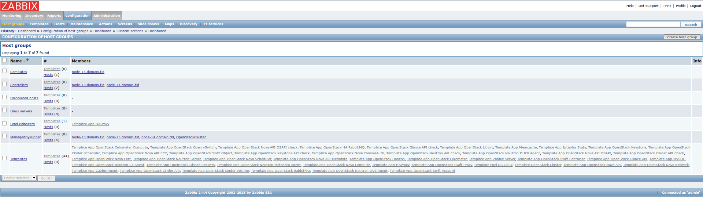
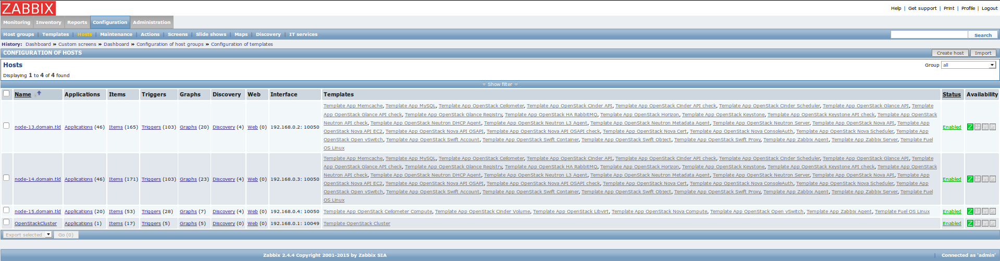
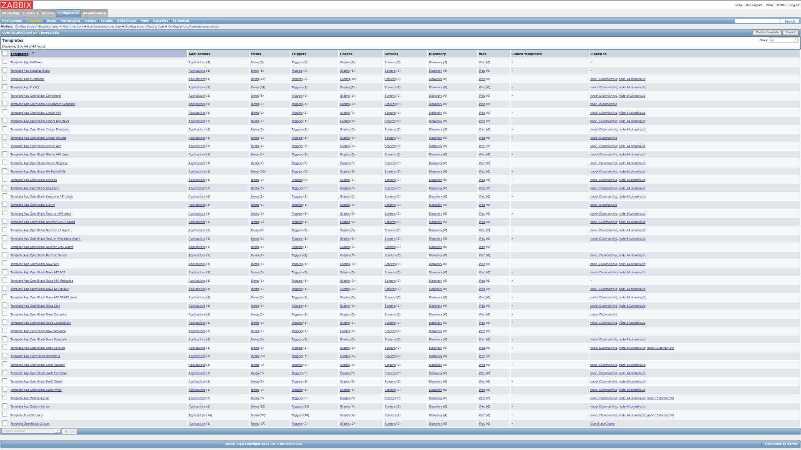

==========
User Guide
==========

Important preliminary notes
===========================

- It is highly recommended to do a network verification check prior
  to any deployment.
- This plugin version supports both CentOS and Ubuntu OS types.
- You can also choose any supervisor and/or also change the
  networking configuration according to your needs.
- Please note however that the Zabbix server will be located on the
  controller nodes and that the MySQL database which Zabbix will use
  is common to all other OpenStack components. This might have a very
  important impact on CPU and/or memory usage on controller nodes as
  well as disk space consumption in /var/lib/mysql due to the fact that
  Zabbix is gathering quite an important number of metrics and quite
  frequently (see known problems hereafter).
- If you want Zabbix to operate in HA mode, you need to select several
  nodes as controllers so that the deployment automatically enables
  Zabbix high-availability.

Known problems
==============

- If a base-os role node is deployed within the environment, the plugin
  installation may fail because the management network is not configured
  (see bug `1515956 <https://bugs.launchpad.net/fuel-plugins/+bug/1515956>`_).

- If you remove some nodes after initial deployments, their related informations
  will not be removed from the Zabbix collected metrics and you will have to
  remove these manually from the Zabbix UI.

- `#1529642 <https://bugs.launchpad.net/fuel-plugins/+bug/1529642>`_:
  Service "zabbix\_server" was restarted after executing of task
  "upload\_core\_repos".

- MySQL database is common with other OpenStack services (see `1531834 <https://bugs.launchpad.net/fuel-plugins/+bug/1531834>`_)
  This has a potential high impact on the disk sizing for /var/lib/mysql even
  though the biggest set of data has been cut down drastically.

- Zabbix server service is located on one of the controller nodes
  therefore and in the exact same manner than `1531834 <https://bugs.launchpad.net/fuel-plugins/+bug/1531834>`_ can impact disk space,
  this can have a significant CPU and/or memory usage on controller nodes for large deployment.

Environment configuration
=========================

#. Create an environment.

   For more information about environment
   creation, see `Create a new OpenStack environment in Mirantis OpenStack User Guide
   <http://docs.mirantis.com/openstack/fuel/fuel-6.1/user-guide.html#create-a-new-openstack-environment>`_.

#. Open Settings tab of the Fuel web UI and scroll the page down.

   Select the plugin checkbox and set credentials for Zabbix Administrator and
   Zabbix Database:

   |zabbix_fuel_ui.png|

   You could see default passwords by clicking on the eye icon.

   It is highly recommended to change default passwords for Zabbix Administrator
   and Zabbix Database.

#. Adjust other environment settings to your requirements and deploy the
   environment.

   For more information, see `Deploy changes in Mirantis OpenStack User Guide 
   <http://docs.mirantis.com/openstack/fuel/fuel-6.1/user-guide.html#deploy-changes>`_.

Zabbix frontend UI
==================

#. After successful deployment you will see a green notification:
   "Deployment of environment 'test' is done".

   Access the OpenStack dashboard (Horizon) at
   `http://172.16.0.2/ <http://172.16.0.2/>`_.

   In this example, 172.16.0.2 is the VIP address (see troubleshooting
   section to see how to get this IP address).

   Zabbix UI will be available
   at `http://172.16.0.2/zabbix <http://172.16.0.2/zabbix>`_
   (at ``http://<VIP>/zabbix`` in general).

   After opening this address in a browser, you should see Zabbix login page:

   .. |zabbix_login_page.png| image:: ../images/zabbix_login_page.png
      :alt: zabbix_login_page.png

   |zabbix_login_page.png|

#. Now log into Zabbix with the credentials set provided on
   the Settings tab of the Fuel web UI (see step 2 in the `Environment
   configuration <#environment-configuration>`_ section).

   After logging into Zabbix, you will see the Zabbix Dashboard page:

   .. |zabbix_dashboard.png| image:: ../images/zabbix_dashboard.png
      :alt: zabbix_dashboard.png

   |zabbix_dashboard.png|

#. The Zabbix Dashboard page provides information on running processes and
   their state.

   If all processes are running successfully in the environment, you should
   see only green colour.

   To demonstrate that monitoring is working properly, the Nova Scheduler
   process had been turned off.

   You can notice that Zabbix detected the
   halted process and provided the problem description: Nova Scheduler
   process is not running on node-13.domain.tld.

   When you go to Monitoring->Screens page, you will see the OpenStack
   Cluster screen:

   .. |zabbix_openstack_cluster_screen.png| image:: ../images/zabbix_openstack_cluster_screen.png
      :alt: zabbix_openstack_cluster_screen.png

   |zabbix_openstack_cluster_screen.png|

   .. |zabbix_openstack_cluster_screen_emphasis.png| image:: ../images/zabbix_openstack_cluster_screen_emphasis.png
      :alt: zabbix_openstack_cluster_screen_emphasis.png

   |zabbix_openstack_cluster_screen_emphasis.png|

   On this screen you have general statistics and graphs presenting
   resources usage in OpenStack environment.

   There is also a list of last 10 events recorded by Zabbix.

Pages
-----

Below there are a few screenshots from Zabbix configuration pages to
show how it should look after a successful environment deployment.
Zabbix UI provides several pages placed under Configuration tab.

Host groups page
^^^^^^^^^^^^^^^^

This page has a list of host groups with their members. There are
separate groups for Controllers and Computes. These groups are used to
join nodes with the same role in OpenStack environment. There is also
ManagedByPuppet group which contains all OpenStack nodes. Remaining host
groups are created by default in Zabbix. For more information and
instructions, see `6.1 Hosts and host
groups <https://www.zabbix.com/documentation/2.4/manual/config/hosts>`_ chapter
in the official Zabbix Documentation.

|zabbix_host_groups.png|

Hosts page
^^^^^^^^^^

This page contains a list of all monitored OpenStack nodes and,
additionally one OpenStackCluster virtual host which represents
OpenStack API. There are also lists of linked monitoring templates to
particular hosts. During installation, the plugin detects which services
have been installed on a particular node and links appropriate templates
to the node to enable monitoring for those services. There is an Zabbix
agent availability report in the last column. When ‘Z’ icon is green,
the Zabbix agent on this node is running and available.

|zabbix_hosts.png|

.. |zabbix_hosts_emphasis.png| image:: ../images/zabbix_hosts_emphasis.png
   :alt: zabbix_hosts_emphasis.png

|zabbix_hosts_emphasis.png|

Templates page
^^^^^^^^^^^^^^

This page contains a list of all monitoring templates and list of hosts
to which they are linked. A monitoring template is a way to group items,
graphs and thresholds which monitor a particular resource type, for
example an OpenStack service like Nova Compute. For more information and
instructions, see `6.6
Templates <https://www.zabbix.com/documentation/2.4/manual/config/templates>`_ chapter
in the official Zabbix Documentation.

|zabbix_templates.png|

.. |zabbix_templates_emphasis.png| image:: ../images/zabbix_templates_emphasis.png
   :alt: zabbix_templates_emphasis.png

|zabbix_templates_emphasis.png|

You can add an additional items (checks), create triggers and events via
Zabbix UI. For more information and instructions, see `6.2
Items <https://www.zabbix.com/documentation/2.4/manual/config/items>`_, `6.3
Triggers <https://www.zabbix.com/documentation/2.4/manual/config/triggers>`_ and
`6.4
Events <https://www.zabbix.com/documentation/2.4/manual/config/events>`_ chapters
in the official Zabbix Documentation.

By default, there are no notifications configured, but you can add them
into the Zabbix UI. For more information and instructions, see `6.7
Notifications upon
events <https://www.zabbix.com/documentation/2.4/manual/config/notifications>`_ chapter
in the official Zabbix Documentation.

